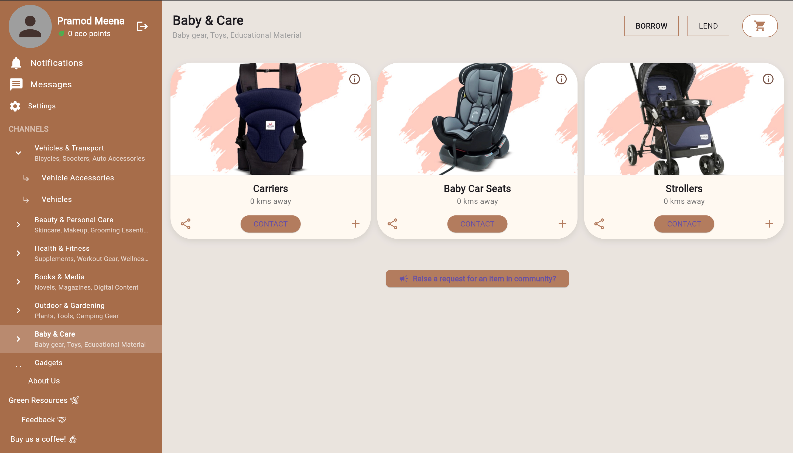
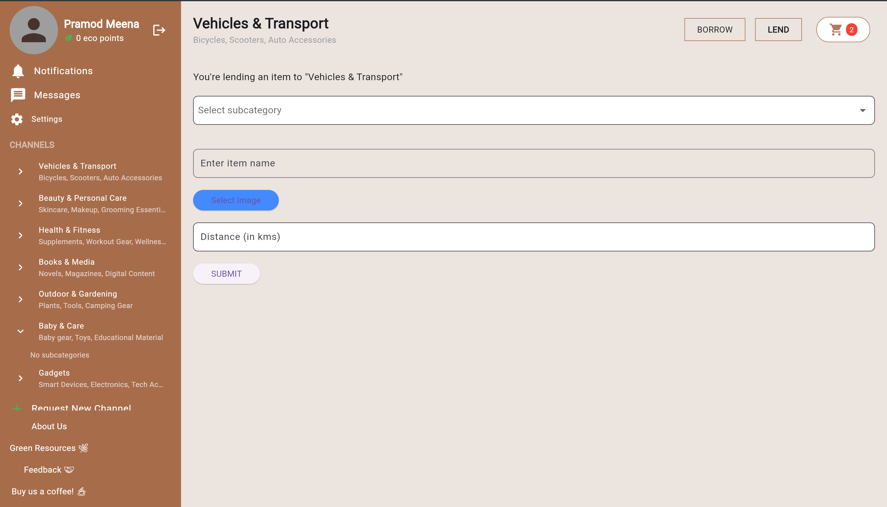
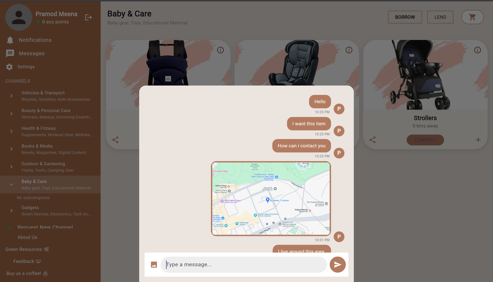
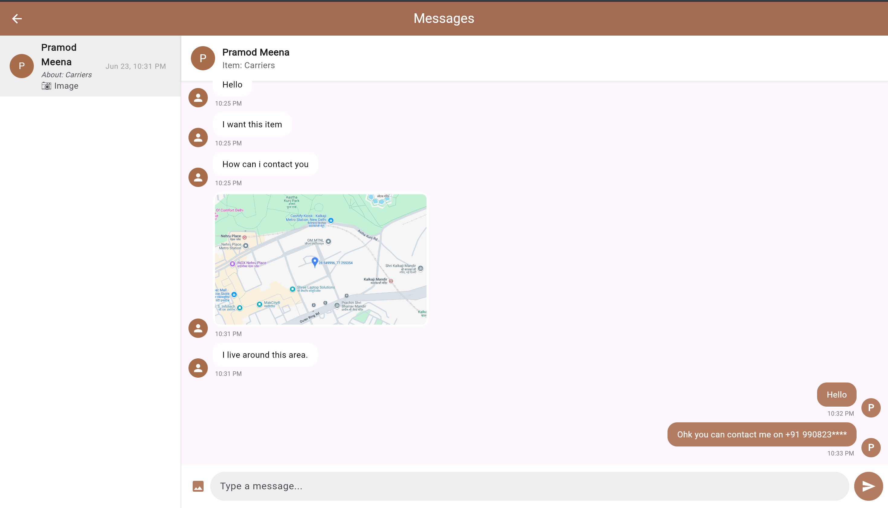
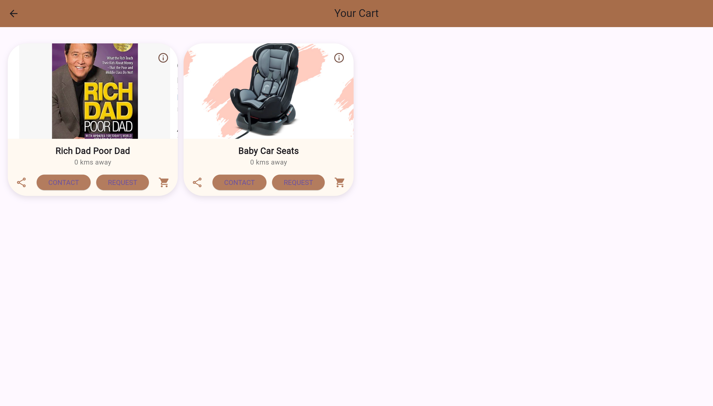

# Revive and Thrive - Community Share App

## Project Description

The Community Share Web App is a Flutter + Firebase application designed to facilitate sharing of unused items such as books and household goods within local communities. The platform enables users to easily borrow or lend items, helping reduce waste and build stronger community connections.

- **Built with Flutter + Firebase** for a responsive, cross-platform experience that works seamlessly on web and mobile devices
- **Implemented Google Sign-In and Firebase Authentication** for secure user access
- **Clean, intuitive homepage** featuring categorized items available to borrow or lend
- **Alert system** that notifies users when desired items become available within a specified range (e.g., 10 km)
- **Real-time direct messaging** with support for text, contacts, and images to coordinate item exchanges

## Screenshots

### Homepage


### Item Lending Interface


### Chat Interface When Clicking an Item


### Messages Dashboard


### Your Cart Page


## Features

- **Secure Authentication**: Google Sign-In and Firebase Authentication for safe and easy access
- **Item Categorization**: Browse and list items by categories and subcategories
- **Smart Alert System**: Request notifications when unavailable items become available within a specific range
- **Real-time Messaging**: Direct communication between users with support for:
  - Text messages
  - Contact information sharing
  - Image attachments
- **Borrowing Request System**: Structured workflow for requesting, approving, and tracking borrowed items
- **Location-Based Search**: Find items available within your community or specified distance
- **User Profiles**: Manage your shared items and borrowing history
- **Push Notifications**: Stay updated on request status and new messages

## Installation and Setup

### Prerequisites
- Flutter SDK (3.6.1 or higher)
- Dart SDK
- A Firebase project

### Setup Steps

1. Clone the repository:
   ```bash
   git clone https://github.com/yourusername/revive-and-thrive.git
   cd revive-and-thrive
   ```

2. Set up environment variables by running the setup script:
   ```bash
   ./setup_env.sh
   ```

3. Edit the newly created `.env` file with your Firebase configuration values:
   ```
   # Firebase Configuration
   FIREBASE_WEB_API_KEY=your_web_api_key
   FIREBASE_ANDROID_API_KEY=your_android_api_key
   FIREBASE_IOS_API_KEY=your_ios_api_key
   # ... other configuration values
   ```

4. Install project dependencies:
   ```bash
   flutter pub get
   ```

5. Run the application:
   ```bash
   flutter run -d chrome  # For web
   # OR
   flutter run            # For mobile
   ```

## Usage

1. **Sign in** using your Google account or email
2. **Browse categories** to find items available for borrowing
3. **Request items** by sending a message to the owner
4. **List your items** for others to borrow by adding images and descriptions
5. **Manage requests** through the notifications dashboard
6. **Communicate** with other users via the in-app messaging system

## Technologies Used

- **Frontend**: Flutter
- **Backend**: Firebase
- **Authentication**: Firebase Auth, Google Sign-In
- **Database**: Cloud Firestore
- **Storage**: Firebase Storage
- **Messaging**: Firebase Cloud Messaging
- **Location Services**: Geolocator
- **State Management**: Flutter's built-in state management

## Security Practices

- Environment variables stored in a `.env` file (excluded from version control)
- API keys and sensitive credentials protected using `flutter_dotenv`
- Authentication with industry-standard OAuth 2.0 via Google
- Firestore security rules to control data access
